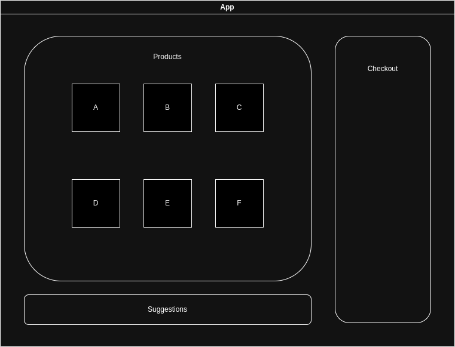
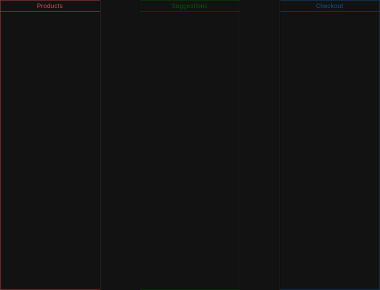
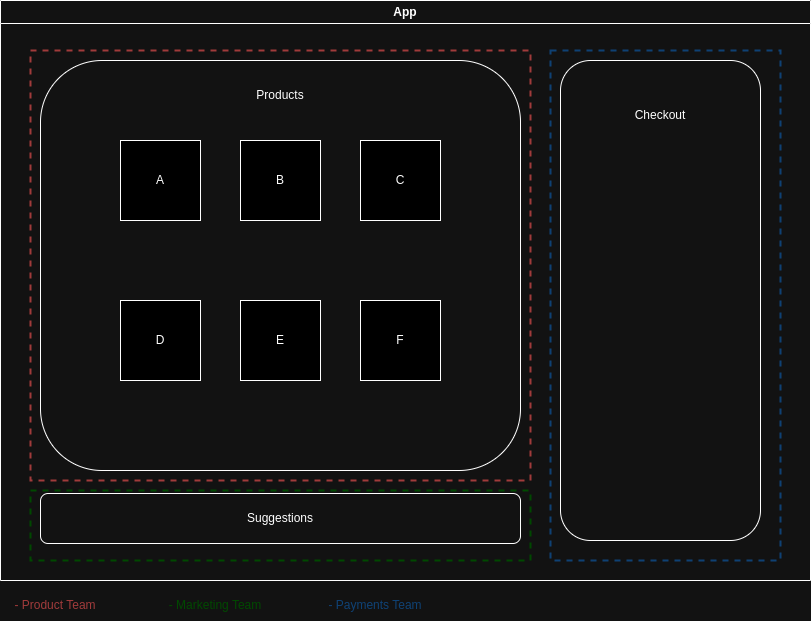

# Monolith vs Micro-frontend

Consider the following diagram a frontend monolith

Every component of this diagram is tightly coupled to each other. In order to complete a checkout you will need to somehow interact with more than one of each components. This coupling makes it difficult to change something without affecting the other components.

## Solutions

When it comes to decoupling a monolith application, there are multiple approaches, and the choice of one or the other will depend on the context, the business needs, the team’s maturity, and the technical debt.

### The Modulith (Modular applications)

Break apart a monolith into modules that can be independently worked on. This is a valid approach to decouple a large application, the difference between a Modulith and a Micro-\* distributed architecture, is that those losely coupled modules are still typically deployed together.

### Micro-frontends

One of the most important decisions to make, in terms of composable decoupled frontends, is the split strategy or whether we will be splitting the frontend horizontally, or vertically. We may also resort to hybrid composition, with a combination of multiple technologies or using innovative patterns like island architecture (supported by [astro](https://docs.astro.build/en/concepts/islands/))

#### Vertical Split

When we’re decoupling a monolithic frontend or designing a composable system from the get go, and we split it into multiple fully-fledged applications each loading at a different URL, we’re implementing a vertical split.

#### Horizontal Split (This will be presented)

The horizontal split represents a pattern that mixes components developed, released, deployed and published by independent teams, but that are integrated into a single application route or view.

