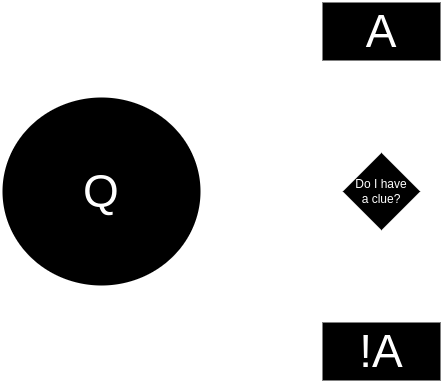

# Outro

Thank you.

## Resources

- https://microservices.io/
- https://microfrontend.dev/
- https://micro-frontends.org/
- https://module-federation.io/
- https://webpack.js.org/concepts/module-federation/
- https://github.com/originjs/vite-plugin-federation
- https://dev.to/marais/webpack-5-and-module-federation-4j1i
- [I stole the title of the presentation from this Jack Herrington's video](https://www.youtube.com/watch?v=t-nchkL9yIg)
